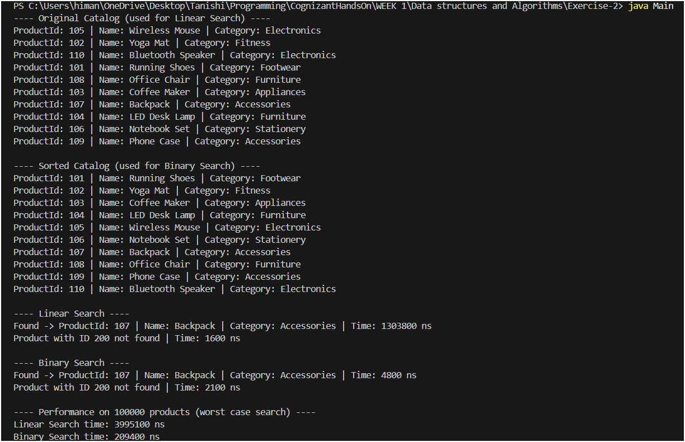

# E-commerce Platform Search Function - Week 1

## Step 1: Understanding Asymptotic Notation

Before writing any code for the search feature, I wanted to get clear on how we actually measure whether a search algorithm is "fast" or "slow", because just running it once on a small list of products doesn't really tell us much. This is where Big O notation comes in.

Big O notation describes how the running time (or sometimes the memory usage) of an algorithm grows as the size of the input grows. It doesn't give us the exact time in seconds, since that depends on the machine, but it gives us an idea of the growth rate. For example, if an algorithm is O(n), doubling the number of products roughly doubles the time it takes. If it's O(log n), doubling the catalog size barely changes the time at all.

This is useful because it lets us compare algorithms without actually running them on huge datasets. For an e-commerce platform, where the product catalog could have thousands or even millions of items, this matters a lot - a search that "feels fine" on 10 products could be unusable on 1,000,000.

For any search operation, there are three cases we usually talk about:

- **Best case** - the situation where the algorithm finds the answer in the fewest possible steps, e.g. the item we're looking for happens to be the very first one checked.
- **Average case** - the expected number of steps if we average over all the positions the target could be in.
- **Worst case** - the maximum number of steps the algorithm could take, usually when the item is at the very end, or not present at all.

For **linear search**:
- Best case: O(1) - the target is the first element checked.
- Average case: O(n) - on average about half the elements get checked.
- Worst case: O(n) - the target is the last element, or it isn't in the array at all.

For **binary search**:
- Best case: O(1) - the target happens to be exactly at the middle on the first check.
- Average case: O(log n) - each comparison cuts the remaining search space in half.
- Worst case: O(log n) - even if the target isn't present, only about log(n) comparisons are needed.

## Step 2: Setup - The Product Class

For the search to work on something meaningful, I created a `Product` class with the attributes that make sense for an e-commerce catalog: `productId`, `productName`, and `category`. This is in `Product.java`. It has a constructor, getters for each field, and a `toString()` so the products print nicely while testing.

## Step 3: Implementation - Linear Search and Binary Search

Both algorithms are written as static methods inside `SearchAlgorithms.java`, and both search by `productId` over an array of `Product` objects.

**Linear Search** - goes through the array one item at a time and checks if `productId` matches the target. It works on the array regardless of whether it's sorted, so I used the original, unsorted catalog array for this one.

**Binary Search** - only works correctly if the array is sorted by `productId`, so I made a sorted copy of the catalog using `Arrays.sort()` with a comparator on `productId`. It repeatedly checks the middle element and, depending on whether the target is smaller or larger, eliminates half of the remaining array each time.

`Main.java` is the driver class - it builds the sample catalog, prints both the original and sorted versions, runs both searches for an ID that exists and one that doesn't, and also runs a performance test on a much larger generated catalog (100,000 products) so the time difference between the two algorithms is actually visible.

## Step 4: Analysis and Comparison

| | Best Case | Average Case | Worst Case |
|---|---|---|---|
| Linear Search | O(1) | O(n) | O(n) |
| Binary Search | O(1) | O(log n) | O(log n) |

From this table it's clear that binary search scales much better as the catalog grows. For a small catalog (the 10-item one in `Main.java`), the difference is basically nothing - both run in a few hundred nanoseconds at most. But once I tested with 100,000 products and searched for the last element (the worst case for linear search), the gap becomes obvious - linear search takes noticeably longer than binary search, even though both are still fast in absolute terms.

For an e-commerce platform, where the catalog can be huge and users expect search results almost instantly, binary search is the better choice when products can be looked up by an indexed/sorted key like `productId`. The trade-off is that binary search needs the data to be sorted beforehand, so if products are added or removed frequently, there's an extra cost in keeping the array sorted (or re-sorting it).

In a real platform, search by product name or category is usually handled with hashing or database indexes (like a B-tree index in SQL) rather than a plain sorted array - but the underlying idea is the same: avoid checking every item one by one, and use the structure of the data to skip large portions of it. For this task, binary search on `productId` is clearly more suitable for fast lookups, while linear search would still be needed in cases where the data can't be kept sorted (e.g. searching by a partial product name).

---

# Program Execution

## How to Run

```bash
javac Product.java SearchAlgorithms.java Main.java
java Main
```

---

## Program Output


```text
---- Original Catalog (used for Linear Search) ----
ProductId: 105 | Name: Wireless Mouse | Category: Electronics
ProductId: 102 | Name: Yoga Mat | Category: Fitness
ProductId: 110 | Name: Bluetooth Speaker | Category: Electronics
ProductId: 101 | Name: Running Shoes | Category: Footwear
ProductId: 108 | Name: Office Chair | Category: Furniture
ProductId: 103 | Name: Coffee Maker | Category: Appliances
ProductId: 107 | Name: Backpack | Category: Accessories
ProductId: 104 | Name: LED Desk Lamp | Category: Furniture
ProductId: 106 | Name: Notebook Set | Category: Stationery
ProductId: 109 | Name: Phone Case | Category: Accessories

---- Sorted Catalog (used for Binary Search) ----
ProductId: 101 | Name: Running Shoes | Category: Footwear
ProductId: 102 | Name: Yoga Mat | Category: Fitness
ProductId: 103 | Name: Coffee Maker | Category: Appliances
ProductId: 104 | Name: LED Desk Lamp | Category: Furniture
ProductId: 105 | Name: Wireless Mouse | Category: Electronics
ProductId: 106 | Name: Notebook Set | Category: Stationery
ProductId: 107 | Name: Backpack | Category: Accessories
ProductId: 108 | Name: Office Chair | Category: Furniture
ProductId: 109 | Name: Phone Case | Category: Accessories
ProductId: 110 | Name: Bluetooth Speaker | Category: Electronics

---- Linear Search ----
Found -> ProductId: 107 | Name: Backpack | Category: Accessories | Time: 3605500 ns
Product with ID 200 not found | Time: 30000 ns

---- Binary Search ----
Found -> ProductId: 107 | Name: Backpack | Category: Accessories | Time: 15900 ns
Product with ID 200 not found | Time: 4200 ns

---- Performance on 100000 products (worst case search) ----
Linear Search time: 7054000 ns
Binary Search time: 13100 ns
```

---

## Output Screenshot

Screenshot of the program execution:



---

# Files Included

```text
Exercise-2/
│
├── Main.java
├── Product.java
├── SearchAlgorithms.java
├── Report.md
└── output.png
```

---

# Conclusion

This exercise compares Linear Search and Binary Search for product lookup in an e-commerce platform.

Linear Search works on unsorted data but requires checking elements one by one, resulting in O(n) time complexity in the average and worst cases.

Binary Search requires sorted data but significantly improves search performance with O(log n) complexity, making it more suitable for large product catalogs.

The implementation and performance comparison demonstrate why efficient searching techniques are important in real-world applications.