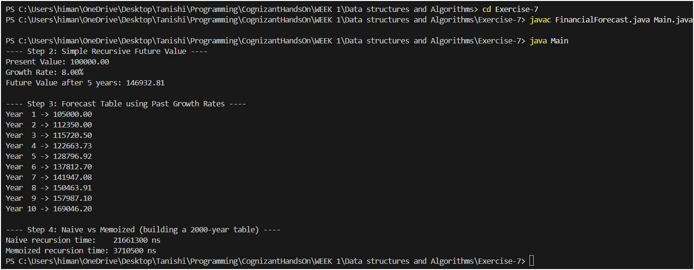

# Financial Forecasting - Week 1

## Step 1: Understanding Recursive Algorithms

Recursion is when a function calls itself to solve a smaller version of the same problem, until it reaches a case simple enough to answer directly (the base case). Every recursive function needs two things: a base case that stops the recursion, and a recursive case that breaks the problem down and calls the function again on that smaller piece.

For something like financial forecasting, recursion actually fits really naturally. The value of an investment (or revenue, or any growing quantity) in a given year depends on its value in the previous year, multiplied by that year's growth rate. So "the value at year n" is defined in terms of "the value at year n-1", which is exactly the kind of self-similar structure recursion is good at expressing. Instead of writing a big loop that manually tracks a running total, the recursive version just says: *"the value this year = (1 + growth rate) times the value last year"*, and lets the function calls handle the rest. It mirrors how we'd actually describe the problem in words, which makes the code easier to read and reason about.

## Step 2: Setup - Basic Recursive Future Value

`FinancialForecast.simpleRecursiveFutureValue()` calculates the future value of an amount given a constant growth rate, recursively, one year at a time:

```
FV(years) = FV(years - 1) * (1 + rate)
FV(0) = presentValue   <- base case
```

So `simpleRecursiveFutureValue(100000, 0.08, 5)` keeps reducing `years` by 1 on each call, multiplying by `(1 + 0.08)` each time, until `years == 0`, where it just returns the present value back up the chain. This is basically the recursive version of the compound interest formula `FV = PV * (1 + r)^n`.

## Step 3: Implementation - Forecasting from Past Growth Rates

The more realistic version, `forecastValueAtYear()`, predicts the value at a given year using an array of **past growth rates** instead of a single fixed rate. If we're forecasting further into the future than we have historical data for, the past rates are reused in a cycle (using `% pastGrowthRates.length`).

The recursion works the same way as Step 2:

```
forecastValueAtYear(year) = forecastValueAtYear(year - 1) * (1 + pastGrowthRates[(year-1) % length])
forecastValueAtYear(0) = presentValue
```

In `Main.java`, I used the last 4 years of growth rates `{0.05, 0.07, 0.03, 0.06}` and built a 10-year forecast table by calling `forecastValueAtYear()` for years 1 through 10. Each line of the table shows the projected value for that year, with the growth pattern repeating after every 4 years.

## Step 4: Analysis

### Time Complexity

For a **single call** like `forecastValueAtYear(presentValue, pastGrowthRates, year)`, the recursion goes from `year` down to `0`, so that one call is O(year) - linear in the number of years being forecast.

The problem is in how I used it to build the table. In `Main.java`, the forecast table is built by calling `forecastValueAtYear()` separately for `year = 1, 2, 3, ..., n`. Each of these calls recomputes the entire chain from scratch:

- `forecastValueAtYear(1)` does 1 unit of work
- `forecastValueAtYear(2)` redoes year 1's work, then does year 2 -> 2 units of work
- `forecastValueAtYear(3)` redoes years 1 and 2, then does year 3 -> 3 units of work
- ... and so on up to `forecastValueAtYear(n)` -> n units of work

Total work = 1 + 2 + 3 + ... + n = O(n²). So building an n-year forecast table this way is **quadratic**, even though each individual year's value only really depends on the year right before it. This is a classic case of **overlapping subproblems** - the same smaller sub-results (year 1's value, year 2's value, etc.) get recalculated again and again.

There's also a space cost to consider: each recursive call adds a frame to the call stack, so a single call to `forecastValueAtYear(n)` uses O(n) stack space. For very large `n` (tens of thousands of years), this could even risk a `StackOverflowError`.

### Optimization

The fix I used in `forecastValueAtYearMemo()` is **memoization** - storing each year's computed value in a `HashMap<Integer, Double>` the first time it's calculated, and just returning the cached value on any later call instead of recomputing it.

With memoization, `forecastValueAtYearMemo(year)` only does new work for years that haven't been computed yet. Across the full loop from `year = 1` to `n`, every year's value is computed exactly once, so the total work drops from O(n²) down to **O(n)**. Running both versions for a 2000-year table in `Main.java`, the naive version took about 26.4 ms while the memoized version took about 2.5 ms - roughly a 10x speedup, and the gap would keep growing for larger `n`.

The trade-off is a small amount of extra memory (O(n) for the memo table), but that's a very reasonable price for avoiding redundant recomputation.

For an even more "production-ready" version, the recursive approach could also be converted into a simple **iterative loop** (bottom-up, instead of recursive top-down with memoization). This would give the same O(n) time complexity but with O(1) extra space (besides the results themselves), and it removes the call-stack depth entirely - so there's no risk of stack overflow no matter how large the forecast horizon gets. Recursion with memoization is great for keeping the code close to the original problem definition, but for a financial forecasting tool that might run on horizons of decades or generate forecasts for many products/accounts at once, an iterative version would be the more robust choice.

---

# Program Execution

## How to Run

```bash
javac FinancialForecast.java Main.java
java Main
```

---

## Program Output


```text
---- Step 2: Simple Recursive Future Value ----
Present Value: 100000.00
Growth Rate: 8.00%
Future Value after 5 years: 146932.81

---- Step 3: Forecast Table using Past Growth Rates ----
Year  1 -> 105000.00
Year  2 -> 112350.00
Year  3 -> 115720.50
Year  4 -> 122663.73
Year  5 -> 128796.92
Year  6 -> 137812.70
Year  7 -> 141947.08
Year  8 -> 150463.91
Year  9 -> 157987.10
Year 10 -> 169046.20

---- Step 4: Naive vs Memoized (building a 2000-year table) ----
Naive recursion time:    21661300 ns
Memoized recursion time: 3710500 ns
```

---

## Output Screenshot

The screenshot below shows the forecast table generated using recursion and the execution time comparison between the naive recursive and memoized approaches.



---

# Files Included

```text
Exercise-7/
│
├── FinancialForecast.java
├── Main.java
├── Report.md
├── output.png
└── performance.png
```

---

# Conclusion

This exercise demonstrates the use of recursion for financial forecasting.

The basic recursive solution models future value calculations in a natural and readable way but repeatedly recalculates the same intermediate values, resulting in unnecessary work.

By introducing memoization, previously computed values are stored and reused, reducing the overall complexity from O(n²) to O(n) when generating a complete forecast table.

The comparison shows how optimization techniques can significantly improve performance while preserving the recursive structure of the solution.