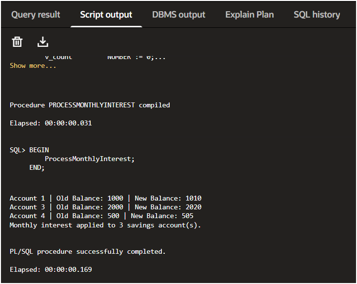
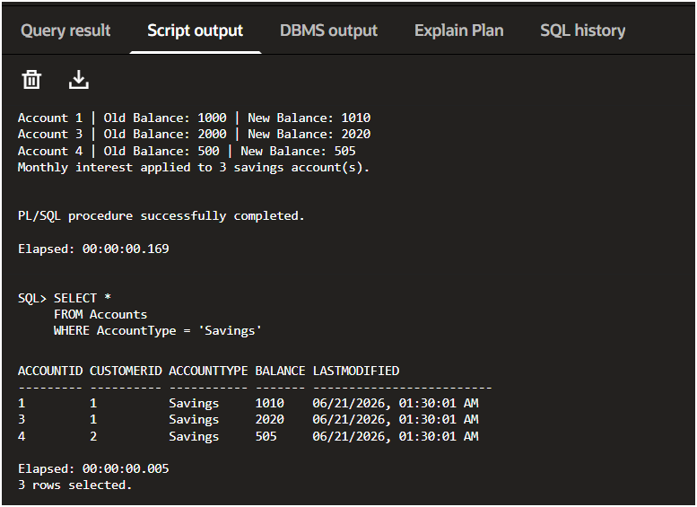
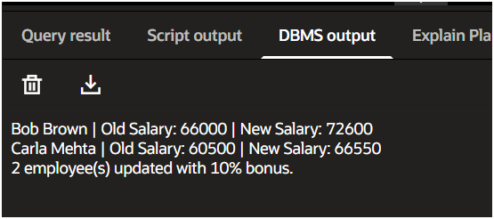
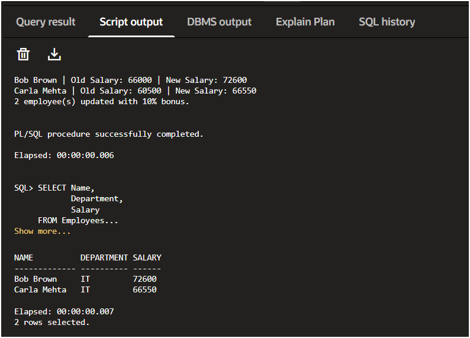
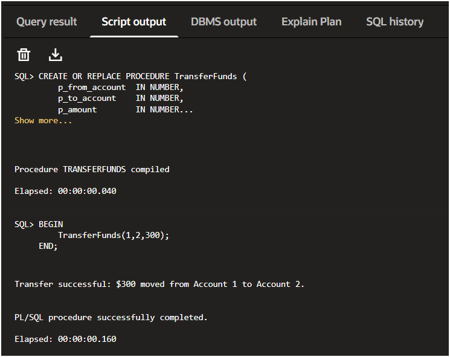
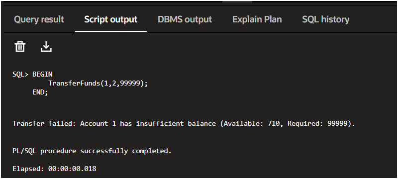
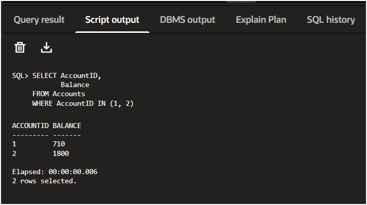

# Exercise 3: Stored Procedures

This exercise focuses on creating and testing stored procedures in Oracle PL/SQL. The scenarios cover interest processing, employee salary updates, and fund transfers between bank accounts.

## Files in this Folder

- `schema_and_data.sql` – Creates the required tables and inserts sample data.
- `scenario1_process_monthly_interest.sql` – Procedure for applying monthly interest to savings accounts.
- `scenario2_update_employee_bonus.sql` – Procedure for updating employee salaries based on department and bonus percentage.
- `scenario3_transfer_funds.sql` – Procedure for transferring money between accounts with validation and error handling.

---

## How I Tested the Procedures

1. Ran `schema_and_data.sql` to create the tables and insert sample records.
2. Enabled console output using:

```sql
SET SERVEROUTPUT ON;
```

3. Executed each procedure individually and verified the changes using SELECT queries.

---

# Scenario 1: ProcessMonthlyInterest

### Objective

Apply 1% monthly interest to all Savings accounts.

### Approach

A cursor loop is used to iterate through every account where `AccountType = 'Savings'`.

For each account:

- Current balance is fetched
- 1% interest is calculated
- Balance is updated
- Old and new balances are displayed using `DBMS_OUTPUT.PUT_LINE`

I chose to use a loop instead of a single UPDATE statement because the exercise specifically asks for processing records individually, and it also makes verification easier.

### Run

```sql
EXEC ProcessMonthlyInterest;
```

### Output



### Verification Query

```sql
SELECT *
FROM Accounts
WHERE AccountType = 'Savings';
```

### Verification Screenshot



### Observation

Savings account balances increased by 1%, while Checking accounts remained unchanged.

---

# Scenario 2: UpdateEmployeeBonus

### Objective

Increase employee salaries based on department and bonus percentage.

### Approach

The procedure accepts:

- Department Name
- Bonus Percentage

It then:

- Finds employees belonging to that department
- Calculates the new salary
- Updates the salary
- Displays old and new salary values

I also added validation so that invalid bonus percentages (0 or negative values) are rejected.

### Run

```sql
EXEC UpdateEmployeeBonus('IT', 10);
```

This applies a 10% salary increase to employees in the IT department.

### Output



### Verification Query

```sql
SELECT Name,
       Department,
       Salary
FROM Employees
WHERE Department = 'IT';
```

### Verification Screenshot



### Observation

Only employees from the IT department received the salary increase. Employees from other departments were not affected.

---

# Scenario 3: TransferFunds

### Objective

Transfer money from one account to another while ensuring sufficient balance is available.

### Approach

The procedure performs the following checks:

1. Transfer amount must be greater than zero.
2. Destination account must exist.
3. Source account balance is locked and checked using `SELECT ... FOR UPDATE`.
4. If sufficient funds are available:
   - Amount is deducted from source account.
   - Amount is added to destination account.
   - Transaction is committed.
5. If balance is insufficient:
   - Transfer is cancelled.
   - Rollback is performed.

I also handled exceptions such as invalid account numbers using `NO_DATA_FOUND`.

---

### Successful Transfer

Run:

```sql
EXEC TransferFunds(1, 2, 300);
```

### Output



---

### Failed Transfer

Run:

```sql
EXEC TransferFunds(1, 2, 99999);
```

### Output



---

### Verification Query

```sql
SELECT AccountID,
       Balance
FROM Accounts
WHERE AccountID IN (1, 2);
```

### Verification Screenshot



### Observation

- The first transfer completed successfully and balances were updated correctly.
- The second transfer failed because the source account did not have enough funds.
- Since a rollback was performed, account balances remained unchanged after the failed transaction.

---

# Folder Structure


```text
Exercise-3
│
├── schema_and_data.sql
├── scenario1_process_monthly_interest.sql
├── scenario2_update_employee_bonus.sql
├── scenario3_transfer_funds.sql
├── README.md
│
└── screenshots
    ├── scenario1_output.png
    ├── scenario1_verification.png
    ├── scenario2_output.png
    ├── scenario2_verification.png
    ├── scenario3_success.png
    ├── scenario3_failure.png
    └── scenario3_verification.png
```

---

## What I Learned

- Stored procedures help move business logic into the database layer.
- `DBMS_OUTPUT.PUT_LINE` is useful for debugging and verifying procedure execution.
- `SELECT ... FOR UPDATE` can be used to lock rows before performing updates.
- Transactions should always use `COMMIT` and `ROLLBACK` appropriately.
- Proper exception handling makes procedures more reliable and easier to debug.
- Forgetting `SET SERVEROUTPUT ON` can make it seem like a procedure is not working even though it executed successfully.

---