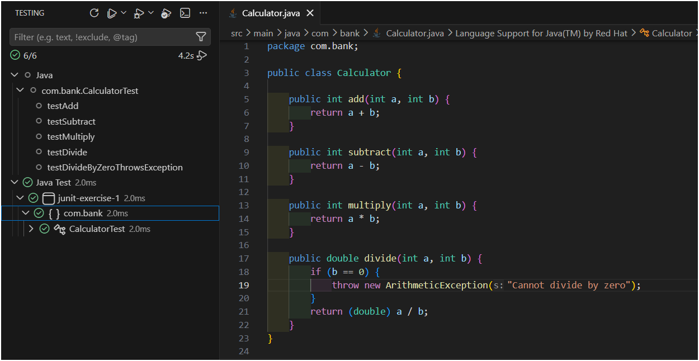

# Exercise 1: Setting Up JUnit

This exercise is about getting JUnit configured in a Java project for the first time, and writing a basic test class to confirm the setup actually works.

I used VS Code for this (not IntelliJ) with the "Extension Pack for Java" extension, since that's what I already had installed.

## Files in this Folder

- `pom.xml` – Maven project file with the JUnit 4.13.2 dependency added.
- `src/main/java/com/bank/Calculator.java` – A simple class with basic arithmetic methods, used as the thing being tested.
- `src/test/java/com/bank/CalculatorTest.java` – The JUnit test class that tests `Calculator`.

---

## How I Set It Up

1. Made sure I had a JDK installed (`java -version` in terminal to check) and installed Maven separately since VS Code doesn't bundle it.
2. Installed the **"Extension Pack for Java"** extension in VS Code (Extensions panel → search → Install). This one extension bundles everything needed: language support, debugger, Maven support, and the test runner.
3. Created the project folder manually with this structure (Maven expects this exact layout, it won't find anything if the folders are named differently):
   ```
   Exercise-1/
   ├── pom.xml
   └── src/
       ├── main/java/com/bank/
       └── test/java/com/bank/
   ```
4. Added the JUnit dependency to `pom.xml`:

```xml
<dependency>
    <groupId>junit</groupId>
    <artifactId>junit</artifactId>
    <version>4.13.2</version>
    <scope>test</scope>
</dependency>
```

5. Opened the `Exercise-1` folder in VS Code (File → Open Folder). It picked up the `pom.xml` automatically and started downloading the JUnit jar in the background — this took a minute or so the first time, status bar at the bottom showed "Java: Loading...".
6. Created `Calculator.java` inside `src/main/java/com/bank/` with a few basic methods (`add`, `subtract`, `multiply`, `divide`) so there'd be something real to test.
7. Created `CalculatorTest.java` inside `src/test/java/com/bank/` (same package name, but under the separate `test` folder — this is the Maven convention, keeps test code completely separate from the actual application code).
8. Once "Java: Ready" showed in the bottom status bar, the flask/beaker-shaped **Testing** icon appeared in the left sidebar. Clicked it, and it listed `CalculatorTest` with all 5 test methods underneath.
9. Clicked the ▶ play button next to `CalculatorTest` to run it.

## CalculatorTest Class

### Objective

Confirm the JUnit setup works by writing a few simple test cases against the `Calculator` class.

### Approach

Each test method is annotated with `@Test`. I also used `@Before` for a `setUp()` method that creates a fresh `Calculator` object before every test, so tests don't accidentally share state.

Tests written:
- `testAdd` – checks `add(2, 3)` returns `5`
- `testSubtract` – checks `subtract(4, 3)` returns `1`
- `testMultiply` – checks `multiply(4, 3)` returns `12`
- `testDivide` – checks `divide(10, 5)` returns `2.0`
- `testDivideByZeroThrowsException` – checks that dividing by zero throws an `ArithmeticException` instead of crashing silently

### Run

Click the **Testing icon** (flask/beaker shape) in the VS Code left sidebar → find `CalculatorTest` under the project → click the ▶ play button next to it.

(Alternatively, open `CalculatorTest.java` directly — small "Run Test" links appear right above each `@Test` method and above the class itself, can click those too.)

### Output



### Observation

All 5 tests passed, each one showing a green checkmark in the Testing panel. This confirms JUnit is correctly installed and wired up to the project, and that test classes are being picked up properly from `src/test/java`.

---

## Folder Structure

```text
Test Driven Development/
└── Exercise-1/
    ├── pom.xml
    ├── README.md
    ├── src/
    │   ├── main/
    │   │   └── java/
    │   │       └── com/
    │   │           └── bank/
    │   │               └── Calculator.java
    │   └── test/
    │       └── java/
    │           └── com/
    │               └── bank/
    │                   └── CalculatorTest.java
    └── screenshots/
        └── exercise1_test_run.png
```

---

## What I Learned

- JUnit needs to be added as a `test` scoped dependency in Maven, not a regular one, since it should only be available when running tests, not in the actual shipped code.
- Test classes conventionally live in `src/test/java`, mirroring the same package structure as `src/main/java`. This keeps test code completely separate from the real application code.
- `@Test` marks a method as a test case that JUnit will run automatically.
- `@Before` runs before every single test method, useful for resetting/creating objects so tests don't interfere with each other.
- `assertEquals(expected, actual)` is the main way to check if a value matches what's expected.
- `assertThrows` is used to check that a method correctly throws an exception, instead of having to wrap it manually in try/catch.
- The first time I ran it, Maven took a bit to download the JUnit jar in the background — VS Code shows this progress in the bottom status bar ("Java: Loading...") and it's easy to think the project is stuck when it's actually just downloading.
- Folder structure isn't just a style preference in Maven — `src/main/java/...` and `src/test/java/...` are exact paths Maven looks for. A `.java` file outside those exact folders just doesn't get compiled or detected as part of the project, even with zero syntax errors in the code itself. Spent a while confused by a "not on the classpath" error before realizing this.
- The Testing panel needs a manual refresh sometimes after fixing project structure — it doesn't always re-scan automatically.