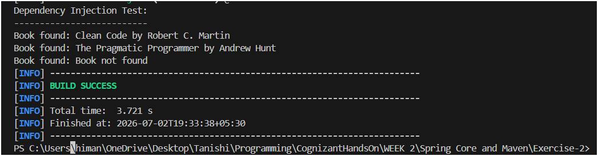

# Exercise 2 - Dependency Injection

## What this does

This exercise wires `BookService` and `BookRepository` together using Spring's Dependency Injection. Instead of `BookService` creating its own `BookRepository` object with `new`, Spring reads the XML config and injects it automatically via a setter method. So `BookService` doesn't need to know how `BookRepository` is created — Spring handles that.

---

## Project Structure

```
Exercise-2/
├── pom.xml
└── src/
    └── main/
        ├── java/com/library/
        │   ├── BookRepository.java
        │   ├── BookService.java
        │   └── LibraryManagementApplication.java
        └── resources/
            └── applicationContext.xml
```

---

## How DI is wired

In `applicationContext.xml`, the `bookRepository` bean is passed into `bookService` using `<property ref="...">`. Spring calls `setBookRepository()` on `BookService` behind the scenes.

```xml
<bean id="bookService" class="com.library.BookService">
    <property name="bookRepository" ref="bookRepository"/>
</bean>
```

---

## How to Run

```bash
cd Exercise-2
mvn clean compile exec:java
```


---

## Expected Output

```
Dependency Injection Test:
--------------------------
Book found: Clean Code by Robert C. Martin
Book found: The Pragmatic Programmer by Andrew Hunt
Book found: Book not found
```

---

## Output Screenshot


